# 🚀 SMS/MMS Or WITH OVH — Application Android Sender ID Alphanumérique


---

> 📱 **Application Android moderne** pour l’envoi de SMS via l’API OVH, avec **gestion sécurisée** des identifiants, **architecture MVVM**, **injection de dépendances (Hilt)**, **Sender ID alphanumérique**, **thèmes personnalisés** et **protection des données** (Git).

---

## ✨ Fonctionnalités principales

🟢 **Envoi de SMS** via l’API HTTP OVH avec ou sans Sender ID alphanumérique  
🔒 **Authentification sécurisée** (token API + persistance locale Room)  
🏗️ **Architecture MVVM** (ViewModel, UseCase, Repository, DataSource)  
🧩 **Injection de dépendances** avec Hilt  
🔔 **Gestion dynamique des permissions** SMS et batterie (Doze)  
🌍 **Support multilingue** (français/anglais)  
🎨 **Thème clair/sombre**, identité graphique personnalisée  
🖼️ **Icônes vectorielles** importées, projet totalement indépendant  
✅ **Bonnes pratiques Android** (modularité, testabilité)  
🌐 **Détection dynamique de l’IP locale** pour l’API REST (NetworkInfoProvider)  
🔄 **Gestion avancée des erreurs SIM/SMS** (retours contextualisés, logs API)  
🧑‍💻 **Icône d’application dynamique** : couleurs du thème appliquées à l’icône (vectorielle, support clair/sombre)  
🌐 **Affichage de l’IP active et des endpoints** dans l’interface principale  

---

## 🏗️ Architecture MVVM

```mermaid
%%{init: {'flowchart': {'curve': 'linear', 'rankSpacing': 60, 'nodeSpacing': 40}, 'theme': 'dark'}}%%
flowchart LR
    Activity[MainActivity]
    Screen["MainScreen<br/>Compose"]
    ViewModel["MainViewModel"]
    State["MainUiState<br/>StateFlow"]
    UC1["UseCases<br/>SendRest SendOvh<br/>GetSettings"]
    Repository["Repositories<br/>Sms Settings"]
    Room[("Room Database<br/>Settings + Tokens")]
    Manager["ServiceControl<br/>Manager"]
    FG["SmsOvh<br/>ForegroundService"]
    Server["SmsRestServer<br/>api/send"]
    SMS["SmsManager"]
    OVH["OVH API"]
    
    Activity -->|onCreate| Screen
    Screen -->|user input| ViewModel
    ViewModel -->|publish| State
    State -->|render| Screen
    
    ViewModel -->|orchestrate| UC1
    UC1 -->|abstract| Repository
    Repository -->|read/write| Room
    Repository -->|persist| Room
    Repository -->|send| SMS
    SMS -->|transport| OVH
    
    ViewModel -->|start/stop| Manager
    Manager -->|control| FG
    FG -->|host| Server
    Server -->|calls| UC1
    Server -->|config/read| Room
    
    classDef uiLayer fill:#1a472a,color:#fff,stroke:#4d7a5d,stroke-width:2px
    classDef vmLayer fill:#2d5a3d,color:#fff,stroke:#5d8a6d,stroke-width:2px
    classDef useLayer fill:#3d6a4d,color:#fff,stroke:#6d9a7d,stroke-width:2px
    classDef repoLayer fill:#4d7a5d,color:#fff,stroke:#7daa8d,stroke-width:2px
    classDef storageLayer fill:#5d8a6d,color:#fff,stroke:#8dba9d,stroke-width:2px
    classDef serviceLayer fill:#6d9a7d,color:#fff,stroke:#9dcaad,stroke-width:2px
    classDef restLayer fill:#7daa8d,color:#fff,stroke:#addbbd,stroke-width:2px
    classDef extLayer fill:#8dba9d,color:#000,stroke:#bdecd0,stroke-width:2px
    
    class Activity,Screen uiLayer
    class ViewModel,State vmLayer
    class UC1 useLayer
    class Repository repoLayer
    class Room storageLayer
    class Manager,FG serviceLayer
    class Server restLayer
    class SMS,OVH,BLE extLayer
```



*Vue paysage optimisée — Architecture MVVM avec flux de données et services*

---


## 🔒 Sécurité & Données

> 🔒 **Sécurité & Données**
>
> - 🔑 **Identifiants OVH + token API** persistés via **Room** (stockage local applicatif)
> - 🛢️ **Réglages et secrets applicatifs** centralisés dans Room pour la reprise d’état
> - 🛡️ **API locale protégée par Bearer token** avec validation des entrées et réponses d’erreur JSON
> - 📲 **Principe du moindre privilège** : permissions demandées en runtime uniquement quand nécessaire (SMS, localisation, batterie)
> - 🔔 **Disponibilité contrôlée** : foreground service + gestion batterie/optimisation pour limiter les interruptions
> - 🗂️ **Hygiène Git renforcée** : exclusions actives (`.gitignore`, `.git/info/exclude`) pour secrets, fichiers IDE, build, APK et artefacts lourds

---

## 📦 Technologies & Bonnes pratiques

- 🟣 **Kotlin + AndroidX** (app moderne, base maintenable)
- 🎨 **Jetpack Compose** pour l’interface (`MainScreen`, composants UI dédiés)
- 🏗️ **Architecture MVVM** avec `ViewModel` + `UiState` (StateFlow)
- 🧠 **Domain layer** avec **UseCases** et séparation claire des responsabilités
- 🗂️ **Repository pattern** (`data/repository`) + sources locales/techniques
- 🧩 **Hilt (DI)** pour l’injection des dépendances à l’échelle de l’application
- 🛢️ **Room** pour la persistance locale des réglages et tokens
- 🌐 **API REST locale** embarquée (NanoHTTPD) pour l’exécution distante SMS/MMS
- 🔐 **Sécurité locale**: token API + `EncryptedSharedPreferences` (MasterKey)
- 🔔 **Permissions runtime** et gestion batterie (foreground service, optimisation)
- 🌗 **Thème clair/sombre** aligné sur la configuration système
- 🌍 **Internationalisation FR/EN** via ressources `values` / `values-fr` / `values-en`
- 🧪 **Tests unitaires et instrumentés** (service, viewmodel, circuits API/SMS)

## 📁 Structure du projet

```text
MS-OVH-SMS/
├── app/
│   ├── src/
│   │   ├── main/
│   │   │   ├── AndroidManifest.xml
│   │   │   ├── java/com/miseservice/msmms/
│   │   │   │   ├── MsMmsApp.kt                ← Application Android + bootstrap global
│   │   │   │   ├── data/
│   │   │   │   │   ├── datasource/            ← Sources techniques et acces plateforme
│   │   │   │   │   ├── local/                 ← Room (DB, DAO, Entity)
│   │   │   │   │   ├── remote/                ← API OVH / appels HTTP / acces distant
│   │   │   │   │   └── repository/            ← Implementations Repository
│   │   │   │   ├── di/                        ← Modules Hilt (bind/provide)
│   │   │   │   ├── domain/
│   │   │   │   │   ├── repository/            ← Contrats metier
│   │   │   │   │   └── usecase/               ← Cas d'usage applicatifs
│   │   │   │   ├── model/                     ← Modeles partages
│   │   │   │   ├── service/                   ← Foreground service + serveur REST local
│   │   │   │   ├── ui/
│   │   │   │   │   ├── MainActivity.kt
│   │   │   │   │   ├── MainScreen.kt
│   │   │   │   │   ├── components/            ← Sections Compose reutilisables
│   │   │   │   │   └── theme/                 ← Couleurs, typo, themes light/dark
│   │   │   │   ├── util/                      ← Helpers (SMS, reseau, permissions)
│   │   │   │   └── viewmodel/                 ← MainViewModel + etat UI
│   │   │   └── res/                           ← Ressources Android (values, mipmap, xml...)
│   │   ├── test/java/com/miseservice/msmms/
│   │   │   ├── data/                          ← Tests unitaires couche data
│   │   │   ├── service/                       ← Tests unitaires services
│   │   │   ├── util/                          ← Tests utilitaires
│   │   │   └── viewmodel/                     ← Tests ViewModel
│   │   └── androidTest/java/com/miseservice/msmms/
│   │       ├── ApiCircuitTest.kt              ← Tests instrumentes API locale
│   │       └── LocalSmsCircuitTest.kt         ← Tests instrumentes envoi local
│   └── build.gradle
├── docs/
│   ├── EXEMPLE_DE_CLIENT_API_REST.md
│   └── MOS_ESP32_GESTIONNAIRE_DE_CHARGE.md
├── screenShots/                               ← Captures d'ecran utilisees dans le README
├── build.gradle
├── settings.gradle
├── gradle.properties
└── README.md
```

---

## 📸 Aperçu de l'interface

| Onglet SMS — Envoi SMS local | Onglet OVH — Configuration API OVH |
|---|---|
|  |  |
| Envoyez des SMS ou MMS directement depuis l'appareil via SmsManager. | Configurez vos identifiants OVH (appKey, secret, consumerKey) et envoyez des SMS via l'API OVH. |

| Onglet API REST — Haut | Onglet Power — Seuils de batterie |
|---|---|
|  |  |
| Configuration du port, affichage de l'IP locale et des endpoints disponibles. | Gestion des seuils batterie Min/Max pour l'optimisation de la charge. |

---

## ⚡ Gestion Power & Automatisation

### 🔋 Chaîne complète : Téléphone Android + MOS ESP32 (gestionnaire de charge)

Le pilotage de charge repose sur un **ensemble complet** :

- **Téléphone Android** : mesure batterie, logique d’automatisation, UI de supervision
- **MOS ESP32** : API REST locale (`/api/status/[PIN]`, `/api/power/[PIN]`) et commutation physique du relais
- **Gestionnaire de charge** : action électrique réelle commandée par la PIN du MOS ESP32

L’application exécute un **cycle automatique de 60 secondes** qui :

1. **Récupère l'état du relais** via `GET /api/status/[PIN]`
2. **Contrôle les seuils batterie** :
   - Si relais OFF et batterie < MIN → **active la charge** (`POST /api/power/[PIN]`)
   - Si relais ON et batterie > MAX → **coupe la charge** (`POST /api/power/[PIN]`)

### 🌐 Découverte DNS/mDNS de l’ESP32 & optimisation IP

**Découverte de l’hôte MOS ESP32 (`.local`)** :
- Résolution DNS + mDNS pour convertir `POWER_SWITCH.local` → `192.168.1.100`
- **IP résolue persistée en base de données** pour les redémarrages
- **Affichée dans l'UI** (champ URL supportingText)

**Optimisation batterie en veille** :
- ✅ **Pas de redécouverte inutile** quand l'IP est déjà en cache
- ✅ **Cycle automatique continue** en arrière-plan (60s avec IP résolue)
- ✅ **Requêtes rapides vers l’ESP32** : `http://IP:PORT/api/status/[PIN]` au lieu de `http://hostname.local`
- 💚 **Économie batterie** : ~50% moins de consommation réseau/CPU en veille

**Configuration** :
- `Min` : Niveau batterie minimum avant charge (défaut: 20%)
- `Max` : Niveau batterie maximum avant coupure (défaut: 80%)
- Reset Découverte : Force une nouvelle résolution DNS si besoin


## 🌐 API REST locale - Accès & Endpoints

### Authentification

- Toutes les routes REST locales sont protégées par token.
- Header obligatoire: `Authorization: Bearer <TOKEN_API>`
- Le token API est généré/copiable depuis l'interface de l'application.
- Sans token valide, la réponse est: `401 Unauthorized`.

### Base URL

- `http://<IP_DU_TELEPHONE>:<PORT>`
- Exemple: `http://<IP_DU_TELEPHONE>:<PORT>`

### Endpoints disponibles

| Methode | Endpoint | Description | Body JSON |
|---|---|---|---|
| `POST` | `/api/send-message` | Envoi intelligent SMS/MMS selon presence de `base64Jpeg` | `senderId?`, `recipient`, `text`, `base64Jpeg?` |
| `POST` | `/api/send-sms` | Envoi SMS texte | `senderId?`, `recipient`, `text` |
| `POST` | `/api/send-mms` | Envoi MMS avec image | `senderId?`, `recipient`, `text?`, `base64Jpeg` |
| `GET` | `/api/logs` | Retourne les 5 derniers logs persistés | Aucun |
| `POST` | `/api/logs` | Ajoute un log applicatif | `message` |
| `GET` | `/api/battery` | Retourne l'état batterie du téléphone | Aucun |

### Exemples de requêtes

```bash
curl -X POST "http://<IP_DU_TELEPHONE>:<PORT>/api/send-message" -H "Content-Type: application/json" -H "Authorization: Bearer <TOKEN_API>" -d "{\"senderId\":\"MYBRAND\",\"recipient\":\"+33612345678\",\"text\":\"Test REST\",\"base64Jpeg\":\"\"}"
curl -X GET "http://<IP_DU_TELEPHONE>:<PORT>/api/logs" -H "Authorization: Bearer <TOKEN_API>"
curl -X GET "http://<IP_DU_TELEPHONE>:<PORT>/api/battery" -H "Authorization: Bearer <TOKEN_API>"
```

### Formats de reponses JSON

Succes (`200`):

```json
{
  "success": true,
  "message": "SMS envoyé avec succès",
  "timestamp": 1775227009115,
  "type": "SMS"
}
```

Erreur (`400`, `401`, `404`, `500`):

```json
{
  "success": false,
  "error": "Missing request body",
  "code": 400,
  "timestamp": 1775226365345
}
```

Réponse dédiée `/api/battery` (`200`):

```json
{
  "success": true,
  "level": 78,
  "isCharging": false,
  "timestamp": 1775227009115
}
```

### Regles de validation importantes

- `recipient` est obligatoire pour les envois SMS/MMS et est normalisé avant envoi.
- `text` est obligatoire pour `/api/send-message` et `/api/send-sms`.
- `base64Jpeg` est obligatoire pour `/api/send-mms`.
- En cas d'erreur de validation, l'API renvoie un JSON d'erreur (jamais de HTML).
- `/api/battery` renvoie le pattern: `success`, `level`, `isCharging`, `timestamp`.

### Format image `base64Jpeg` (MMS)

- Format attendu: image JPEG encodée en Base64 (chaîne texte).
- Le serveur accepte:
  - Base64 brut: `"/9j/4AAQSkZJRgABAQ..."`
  - Data URI: `"data:image/jpeg;base64,/9j/4AAQSkZJRgABAQ..."`
- Espaces et retours à la ligne sont nettoyés côté serveur.
- Taille recommandée: <= 3 MB (limite MMS configurée dans l'app).
**Limite stricte MMS en France : 300 à 600 Ko selon l’opérateur (Bouygues, SFR, Orange, Free, etc.).**
  - Si l’image dépasse cette taille, l’envoi échouera ou l’image sera tronquée.
  - Il est recommandé de compresser/redimensionner l’image avant l’envoi.
  - La taille maximale acceptée peut varier selon le pays et l’opérateur, mais ne jamais dépasser 600 Ko pour une compatibilité maximale.

Exemples clients (Python, PHP, Android) :

Voir la documentation dediee : `docs/EXEMPLE_DE_CLIENT_API_REST.md`

---

## 📡 API OVH utilisée

- Appel HTTP GET à l’API OVH SMS (voir doc officielle)
- Gestion des codes retour (100 = succès, 201/202 = erreur login/mdp, etc.)

---

## ⚠️ Limitations du Sender ID alphanumérique

> ⚠️ **Limitations du Sender ID alphanumérique**
>
> - Max 11 caractères (lettres/chiffres)
> - Pas de réponse possible
> - Doit être validé chez OVH
> - Certains opérateurs/pays peuvent le bloquer

---

## 🤝 Support & Contributions

Pour toute question ou contribution, ouvrez une issue ou une pull request.

---

## 🗂️ Nomenclature des documents

| Document | Emplacement | Rôle |
|---|---|---|
| Exemple de Client | [`docs/EXEMPLE_DE_CLIENT_API_REST.md`](docs/EXEMPLE_DE_CLIENT_API_REST.md) | Exemples clients Python, PHP et Android pour consommer l'API REST SMS / MMS |
| Integration MOS ESP32 | [`docs/MOS_ESP32_GESTIONNAIRE_DE_CHARGE.md`](docs/MOS_ESP32_GESTIONNAIRE_DE_CHARGE.md) | Schema d'integration telephone + MOS ESP32 pour piloter le gestionnaire de charge |

---

> © 2026 MISESERVICE — Architecture MVVM, sécurité, bonnes pratiques Android.
